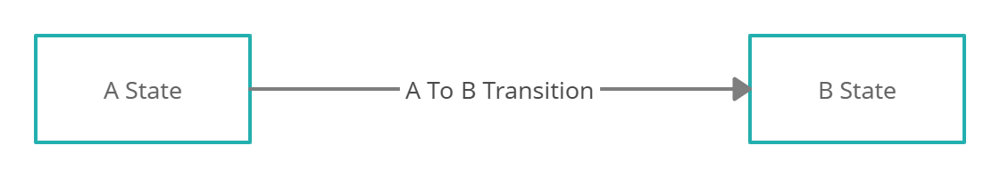
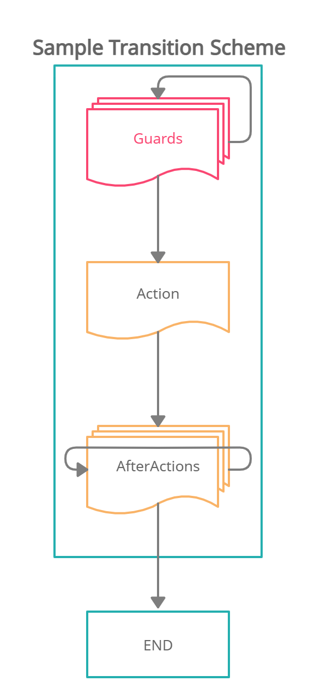

# Laravel State Machine

[](https://packagist.org/packages/caner/state-machine)
[](https://packagist.org/packages/caner/state-machine)
[](https://github.com/CanerErgez/laravel-state-machine/actions/workflows/main.yml)

A simple, model-based state machine package for Laravel.

## Requirements

- PHP 8.2 or later
- Laravel 12 or 13

Laravel 13 requires PHP 8.3 or later.

## Installation

Install the package with Composer:

```bash
composer require caner/state-machine
```

Laravel package discovery registers the service provider automatically.

To customize the package configuration, publish it with:

```bash
php artisan vendor:publish --tag=caner-state-machine-config
```

## Concepts

A state machine describes the states a model can be in and the transitions allowed between those states. Each transition may contain:

1. **Guards** that decide whether the transition may run.
2. An **action** that performs the main operation.
3. **After actions** that run after the action succeeds.





A typical application structure is:

```text
app/
└── Services/
    └── PostStateMachine/
        ├── AfterActions/
        ├── Guards/
        ├── States/
        ├── Transitions/
        └── PostStateMachine.php
```

## Documentation

Follow the guides in this order:

1. [Create a state machine](docs/first_state_machine.md)
2. [Create a state](docs/first_state.md)
3. [Create a transition](docs/first_transition.md)
4. [Create a guard](docs/first_guard.md)
5. [Create an after action](docs/first_after_action.md)
6. [Run a transition](docs/example_transition.md)
7. [Use multiple state machines](docs/create_another_state_machine.md)
8. [Upgrade from v1 to v2](docs/upgrade_v2.md)

## Transition Flow

Transitions run on the model's database connection:

```text
Guards → Action → Automatic state update → After actions → Commit
```

After actions are synchronous and execute before commit. If one fails, the
transition rolls back. Work that must run only after a successful commit should
dispatch a queued job with Laravel's `afterCommit()` option.

Use `canTransitionTo()` and `allowedTransitions()` when a UI or API needs to
inspect the transition graph without executing guards.

## Changelog

See the [changelog](CHANGELOG.md) for release history.

## Contributing

See the [contribution guide](CONTRIBUTING.md) for details.

## Security

If you discover a security issue, please open a GitHub issue.

## Credits

- [Caner Ergez](https://github.com/CanerErgez)
- Special thanks to [Tarfin Labs](https://github.com/tarfin-labs)

## License

This package is open-sourced software licensed under the [MIT license](LICENSE.md).
